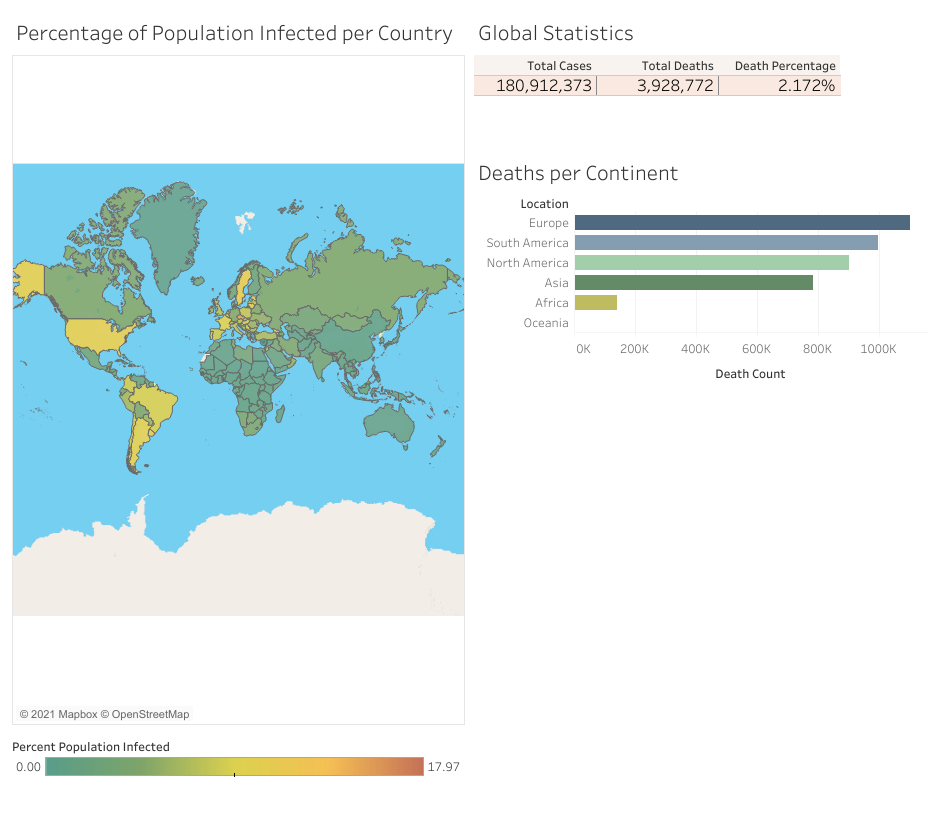

# Covid-19 Data visualization and Exploratory Data Analysis
Exploratory data analysis of Covid-19 infection, vaccination and death rates using SQL and an interactive map and graphs created through the use of Tableau

Live Dashboard available at: https://public.tableau.com/app/profile/max.van.dijck/viz/Covid-19DataVisualization_16252823685560/Dashboard1

*Dashboard Preview created with Tableau*